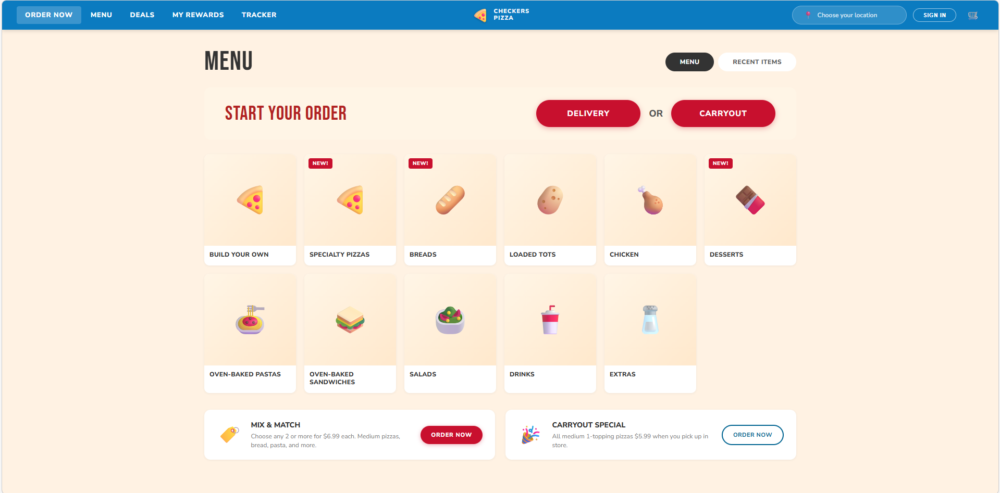

# Pizza Order Demo (Imperative WebMCP Implementation)

A demo site implementing the [imperative version of WebMCP](https://github.com/webmachinelearning/webmcp), a browser API that enables AI agents to discover and interact with tools exposed by web pages. This example demonstrates a 7-step pizza ordering wizard where tools are dynamically registered based on each step of the user journey.



## 🚀 Live Demo

**[Try it now on GitHub Pages](https://victorhuangwq.github.io/pizza-order-demo/)**

## How to Test It

To test this demo with a real WebMCP implementation:

### Chrome with Experimental Platform Features (EPP)

1. **Read the setup guide:** [WebMCP Chrome Blog Post](https://developer.chrome.com/blog/webmcp-epp)
2. **Follow the setup steps:** [WebMCP Setup Instructions](https://docs.google.com/document/d/1rtU1fRPS0bMqd9abMG_hc6K9OAI6soUy3Kh00toAgyk/edit?tab=t.0)
3. **Open the live demo** in your configured Chrome browser, with the developer extension installed.
4. The site will automatically register tools for each step of the ordering process

### Browser Compatibility

| Browser | Status | Notes |
|---------|--------|-------|
| Chrome | ✅ Working | Requires EPP setup (see above) |
| Edge | 🔜 Coming Soon | Support in progress |

## How It Works

This site is a multi-step pizza ordering wizard. At each step, it dynamically registers a different set of tools using `navigator.modelContext.provideContext({ tools })`. An AI agent navigating the site sees only the tools relevant to the current step, enabling a natural, context-aware interaction pattern.

| Step | Description | Tools |
|------|-------------|-------|
| 1 | Select order type | `select-order-type` |
| 2 | Enter delivery address | `set-delivery-address`, `confirm-location` |
| 3 | Choose menu category | `select-category` |
| 4 | Pick a pizza | `select-pizza` |
| 5 | Customize pizza | `customize-pizza`, `add-to-cart` |
| 6 | Review cart | `update-cart-item`, `add-side`, `proceed-to-checkout` |
| 7 | Checkout | `set-checkout-info`, `place-order` |

## Local Development

Run the site locally with npm:

```bash
npm install
npm start
```

Then open **http://localhost:3000** in your browser.

## Project Structure

```
.
├── index.html             # Single-page wizard (all 7 steps)
├── css/
│   └── style.css          # Styling
├── js/
│   ├── app.js             # Wizard logic and state management
│   ├── menu-data.js       # Menu catalog data
│   ├── webmcp-tools.js    # Tool definitions per step
│   └── webmcp-shim.js     # Polyfill for local testing
├── server.js              # Local dev server
└── package.json
```

## For Developers

### Testing with Console Polyfill

For local testing without a WebMCP implementation, this site includes a polyfill that provides a console API. This is helpful for development but not the primary testing method (use the Chrome EPP setup above).

Open the browser console and try:

```javascript
mcp.help()                    // List available tools for current step
mcp.help('select-order-type') // Details for a specific tool
mcp.call('select-order-type', { type: 'delivery' })  // Execute a tool
```

### Deployment

This site is automatically deployed to GitHub Pages via GitHub Actions whenever changes are pushed to the `main` branch. No manual configuration needed.

To view deployment status:
- Go to [Actions tab](https://github.com/victorhuangwq/pizza-order-demo/actions)
- Check the "Deploy to GitHub Pages" workflow
